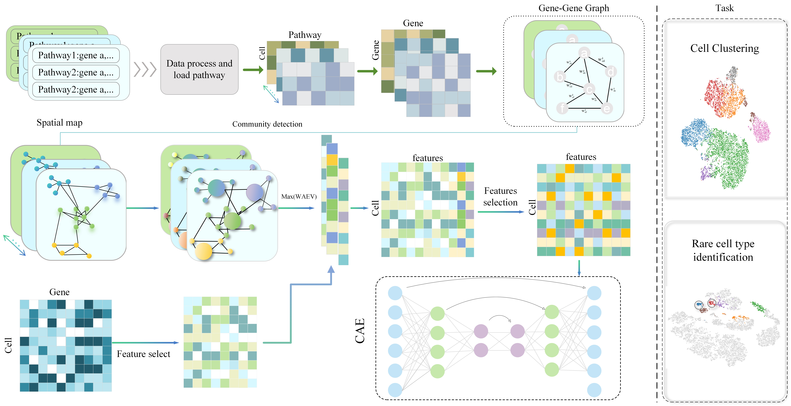

# **scDGG: dynamic gene graph for single-cell clustering from single-cell RNA-seq data**

In this study, we propose the scDGG method to obtain dynamic gene graphs from multiple biological pathways, where each set of gene graphs corresponds to a specific view that captures gene-gene interactions and spatial features. The temporal-spatial variability of views is handled using a shared latent space, a latent space designed to capture the full range of cellular features.

## Architecture



## Install

To use scDGG you must make sure that your python version is greater than 3.8. The best graphics card is RTx3080.

```
conda create -n scDGG python=3.6
source activate scDGG
```

#### Requirements

```
pip install numpy==1.23.5
pip install torchsummary==1.5.1
pip install scikit-learn==1.0.2
pip install scanpy==1.9.1
pip install pandas
torch==1.13.1+cu116
```

The required packages can be installed using the following
command:

``$ pip install -r requirements.txt``

## Data availability
he datasets used were all obtained from the NCBI Gene Expression Omnibus (GEO) database ( https://www.ncbi.nlm.nih.gov/geo/) and the 10X Genomics platform. The pathway datasets used in this paper were mainly obtained from https://github.com/GaoLabXDU/sciPath and https://github.com/Kevis9/scPML. Zeisel Hippocampus Dataset ([GSE60361](https://www.ncbi.nlm.nih.gov/geo/query/acc.cgi?acc=GSE60361)) from Mouse Brain Tissue 3005 cells. Mouse bladder cell dataset Mouse ([GSE60361](https://www.ncbi.nlm.nih.gov/geo/query/acc.cgi?acc=GSE60361)) from the Mouse Cell Atlas project. The dataset Petropoulos ([E-MTAB-3929](https://www.ebi.ac.uk/biostudies/arrayexpress/studies/E-MTAB-3929)) is an scRNA sequence dataset with time series. pbmc_Kang-A, pbmc_Kang-B, pbmc_Kang ([GSE96583](https://www.ncbi.nlm.nih.gov/geo/query/acc.cgi?acc=GSE96583)) were sequenced from peripheral blood of normal individuals by Kang et al. PBMC_Zheng4K, on the other hand, is from [10X Genomics Datasets](https://support.10xgenomics.com/single-cell-gene-expression/datasets/2.1.0/pbmc4k), which are peripheral blood mononuclear cells from healthy donors. PBMC-bench-1, is single-cell multi-omics data collected from bone marrow mononuclear cells of 12 healthy human donors([GSE60361](https://www.ncbi.nlm.nih.gov/geo/query/acc.cgi?acc=GSE194122)). The AD-related dataset was derived from the GEO platform under GEO ID ([GSE98969](https://www.ncbi.nlm.nih.gov/geo/query/acc.cgi)). 

## Usage

If you want to run the dataset, you should first generate three files "data.csv" (gene count matrix, where rows represent cells and columns represent genes),"label.csv" (true label) and pathway datesets. Then you can put your dataset folder containing the above two files ("data.csv" and "label.csv") into "data" and put pathway datesets into "pathway_data/human" or "pathway_data/mouse".

# **gene-gene co-expression matrices construction**
```
Rscript get_gm.R
```
# **dynamic gene graph construction**
```
python Co_analysis.py
```

Then you can run the F-test-Pseudo-label.R to generate the pseudo-label, run the 1-f-test-python.ipynb to generate finall.csv, and put it in 2-preprocess.ipynb to generate the.pkl file that can run the model.

# **Run scDGG**

```
python main.py
```


## Results
After running the program, you will get two files, one is the data name filename.txt file, this file records the model running log, the other is the predictive data clustering labels, which is a.csv file.

We show an example on how to create two tSNE plots with the clustering result and the true cell types. The command can be found in the 3-analysis.ipynb.

In the following two images, the first image is colored with true labels, and the second image is colored with clustering results.
